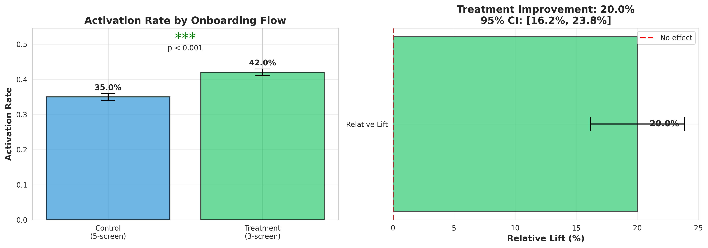

# A/B Testing Framework for Marketing Analytics

## Onboarding Flow Optimization



## Executive Summary
Decision: Ship the 3 screen onboarding flow.

Reducing onboarding from 5 screens to 3 screens increased activation from **35% to 42%** (+20% relative lift, p < 0.001) with meaningful revenue impact and low implementation risk.

## Business Problem
Only 35% of new users were completing onboarding. The remaining 65% dropped off before experiencing core 
product value, directly impacting revenue and growth.

## Hypothesis
**If we simplify onboarding from 5 screens to 3 screens, then activation 
rate will increase because users reach their first key action faster 
with less friction.**

## Methodology
```
1. Define hypothesis & success criteria
2. Calculate required sample size (power analysis)
3. Run experiment (20,000 users, 2 weeks)
4. Analyze results (two-proportion z-test)
5. Visualize findings
6. Make business recommendation
```

## Key Results

| Metric | Control | Treatment | Lift |
|--------|---------|-----------|------|
| Activation Rate | 35% | 42% | **+20%** |
| Users Activated | 3,500 | 4,200 | +700 users |
| Statistical Significance | - | - | p < 0.001  |

## Statistical Confidence
- **P-value:** < 0.001
- **95% Confidence Interval:** [16.2%, 23.8%] relative lift
- **Z-score:** 10.17

## Business Impact
Assuming 100,000 new users per month:
- **Additional activations:** +7,000 users/month
- **Annual impact:** 84,000 additional activated users
- **Revenue impact:** $4.2M additional annual revenue (at $50 LTV)

## Key Deliverable - Decision and Rollout Plan
**Recommendation**
Ship the 3-screen onboarding experience.

**Why**
- Statistically significant +20% lift in activation
- Material revenue upside
- Low engineering risk (UI-only change)

**Guardrails to Monitor**
- 7-day retention rate
- Conversion to paid (if applicable)
- Customer support ticket volume
- Downstream churn rate

**Rollout Plan**
Gradual ramp:
10% then 50% then 100% rollout

Monitor activation, retention, and revenue metrics at each stage.
Rollback if guardrail metrics decline beyond predefined thresholds.

**Next Experiment**
Test personalized onboarding flows based on acquisition channel to further improve activation and early retention.

## Tools & Technologies
Python (core analysis), Numpy (Statistical Calculation), Pandas(Data Manipulation), SciPy (Hypothesis Testing), Matplotlib/Seaborn (Visualization)

## Files
| File | Description |
|------|-------------|
| `ab_testing_framework.ipynb` | Main analysis notebook |
| `ab_test_results.png` | Visualization of results |

## How to Run
1. Open `ab_testing_framework.ipynb` in Google Colab or Jupyter
2. Run all cells (Runtime >>  Run All)
3. Results and visualizations will generate automatically


## Author
Shamsa Khoja | MS Business Analytics, University of Louisville (2025)
www.linkedin.com/in/shamsakhoja | www.github.com/shamsakhoja7-max/ab-testing-framework
